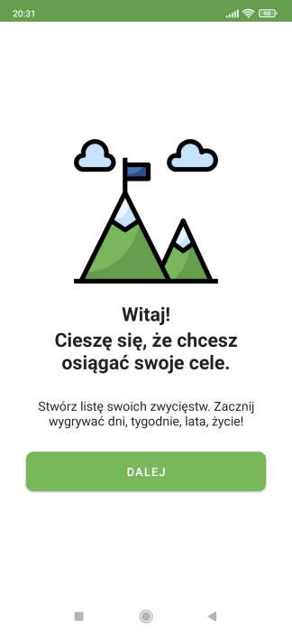
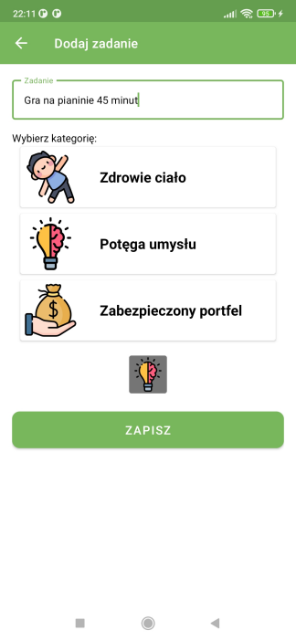
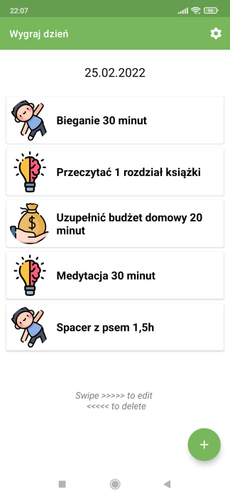
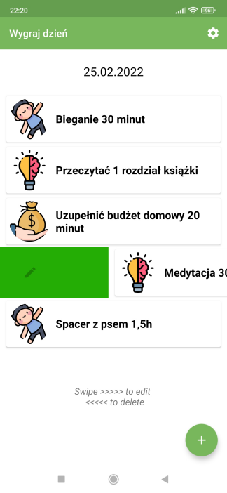
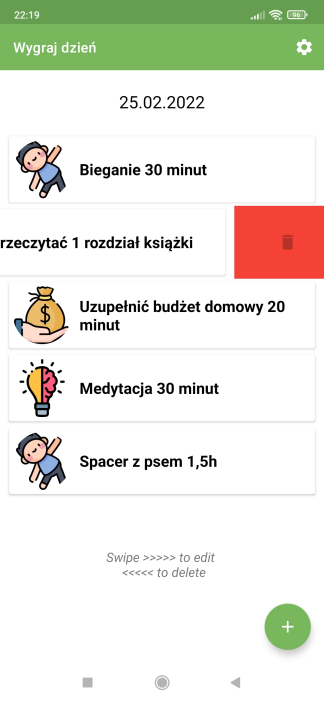
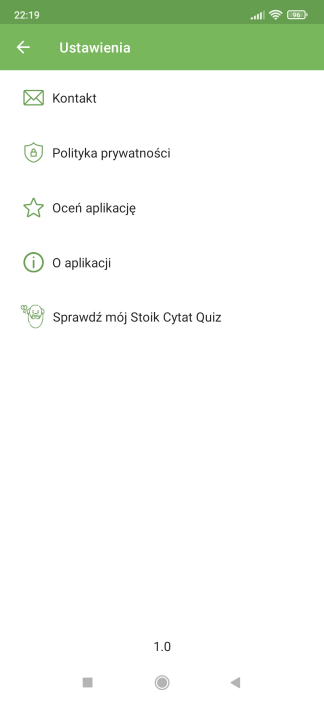

# Wygraj dzień (Win the Day) #

You can download this app on your Android Device:
[Google Play Store](https://play.google.com/store/apps/details?id=pl.glownia.maciej.wygrajdzien)
---

### Goal ### 

Create an application which let user win their days, by doing simple (it not means easy) tasks every
day. It should be simple application with readable interface. Also great opportunity to develop my
programming skills. Hope this app will help me, my friends and all other people build good habits
every day and achieve our own goals.

### Screenshots ###

##### Overview: #####

Application is in polish language. Winning the day means, that user is creating for example 5
tasks (recommended) every day in the morning or before sleep. These tasks should be possible to
accomplish in 3-4 hours. Thanks to this if user starts for example at 6:00 in the morning, before
afternoon he is WINNING THE DAY. And it means they are closer to their goals. Of course they will
see that 3-4 hours will not be enough for them.

1. First activity is to welcome user (after go to the next activity user cannot back to the welcome
   menu),
2. Second activity is to let user to add a new task and to display list of tasks (after add them)
   This task list contains image of task category and title - we can say it is view.
    - To edit task user needs to swipe the view from left to the right.
    - To delete task user needs to swipe the view from right to the left,
    - If user click on the view, is sending to the activity where is short text and quote to
      motivate them. This layout also contains settings button, so user can go to settings area. If
      user press back button there is a dialog to protect from accidentally closing the app.
3. After clicking add button user is sending to add task activity where is possible to name task,
   choose category image and save it to the database,
4. When the task is saved to the database, the task is also displaying on the list in the second
   activity (look above - point 2),
5. When user swipe to edit, they can edit actual task by giving it a new name and also choosing a
   new image. Record in data base is updating.
6. Settings activity contains:
    - send mail to developer,
    - read privacy policy,
    - rate app in the google store,
    - read description about application,
    - link to my another application in Google Play Store -> Stoik Cytat Quiz
    - version of app - available at the bottom of layout.

There is space to develop this app for different features.

### To start this app ###

1. Clone this project,
2. Open Android Studio,
3. Select File -> Open... -> choose this project from path where you cloned it,
4. Set Gradle: File -> Settings -> Build, Execution, Deployment -> Gradle -> Gradle JDK: set up for
   1.8 (if it is necessary),
5. Run the application.

### Requirements: ###

1. Android Studio Bumblebee // 2021.1.1,
2. Minimal Sdk: 21, Recommended: 32.
3. Size of device - recommended minimum 5.00"

### What I have learned during this project? ###

I learned a lot of new stuff. I Improved programming skill regarding to the last project Stoik Cytat
Quiz. Here I keep data in database, using more functions in layouts, and many more. Code is full of
comments. I added them to understand step by step what happen in code.

1. Main concepts:
    - Using Third Party Library -> for circle view and swiping to edit and delete,
    - Room Database (Entity, Dao, Database, App),
    - Interface, Abstract class,
    - New things about gradle,
    - Using adapter to operate with data,
    - Coroutines (lifecycleScope),
    - Binding -> regarding to layout last time,
    - Calendar -> displaying actual date,
    - Serializable, Parcelable,
    - notify -> why needed
    - Swipe item to edit data,
    - Swipe item to delete data,
    - companion object,
2. How to add:
    - different functionality as drawable, buttons, textViews, dimens, constraints layouts, scroll
      view, and more,
    - dialogs (this case custom dialog) when user click back button, but there are other, as e.g
      alert dialog
3. Elements and functions, as:
    - toolbar with settings button
    - make working all buttons and text view,
    - constants,
    - chance again to add links to app for user to go to external sources,
    - also chance again to generate privacy policy,
4. Publish application on the Google Play Store,
5. I also learned that is a good idea to plan more things at the beginning. Visualize how
   application should looks like and how it should works. I made more drawings to see it before I
   wrote the code. So planning is also important part of development. I can see progress. And I hope
   there is a new project in the near future which will be chance for me to learn new things.
6. I improved my English skills.

### I had some problems with: ###

1. Of course there were moments when I struggled with some things, specially those new one.
   Database, AndroidManifest, layouts, etc... sometimes one typo, one missed import, wrong line of
   code can waste a lot of time, but when I was trying to do that in different way, I had more
   opportunities to learn it. Also by the way others things.
2. If I want to develop something faster that I can, is easy way to make mistakes. So good advice
   for myself and others new programmers for future, is to read more carefully documentation,
   recommendations, advice. Also I should make some short tasks to better understand some basic
   concepts of Kotlin and programming in general. Hope next tasks will help me with that.

### Links (to say "Thank you!" for others job): ###

- [hdodenhof - circle view](https://github.com/hdodenhof/CircleImageView)
- [App icons/images](https://www.flaticon.com/free-icons/android) -> sources for images you can find here: [ImagesSources](https://github.com/maciejglownia/WygrajDzien-WinTheDay/blob/master/app/src/main/assets/Sources.txt)
- [Denis Panjuta](https://tutorials.eu/)
- [Privacy Policy Generator](https://app-privacy-policy-generator.firebaseapp.com/)
- [Norio - graphic generator](https://www.norio.be/graphic-generator/)

### Dear Visitor ###

If you see an opportunity to improve my code do not hesitate to contact me:
maciej.k.glownia@gmail.com. If you want to copy it and develop with your own idea, take it and enjoy
learning path.

### Summary ###

There are many concepts, more of them I saw first time. They need to be repeat to understand them
better, but I used many lines of comments to write down explanation to understand, as good as
possible, what happen in this code, which functions are responsible for, and also why some concepts
I should use in these case.