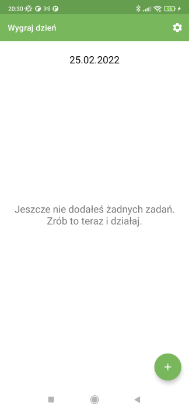

# Wygraj dzień (Win the Day) #

You can download this app on your Android Device:
// todo add the link when the app is deployed
[Google Play Store]()
---

### Goal ### 

Create an application that lets user win their days by doing simple (it does not mean easy) tasks every
day. It should be a simple application with a readable interface. It is also a huge opportunity to develop my
programming skills. I hope this app will help me, my friends, and others, to help build good habits
every day and achieve their own goals.

### Screenshots ###

##### Overview: #####

The application is in Polish language. Winning the day means, that the user is creating for example 5
tasks (recommended) every day in the morning or before sleep. These tasks should be possible to
accomplish in 3-4 hours. Thanks to this if the user starts for example at 6:00 in the morning, before
the afternoon he is WINNING THE DAY. And it means they are closer to their goals. Of course, they will
see that 3-4 hours will not be enough for them.

1. The first activity is to welcome the user (after going to the next activity user cannot back to the welcome
   menu),
2. The second activity is to let the user add a new task and display a list of tasks (after adding them)
   This task list contains an image of the task category and title - we can say it is the view.
   - To edit the task user needs to swipe the view from left to right.
   - To delete a task user needs to swipe the view from right to left,
   - If the user clicks on the view, is sent to the activity where there is short text and quotes to
     motivate them. This layout also contains a settings button, so the user can go to the settings area. If
     the user presses the back button there is a dialog to protect from accidentally closing the app.
3. After clicking the add button user is sent to add task activity where is possible to name a task,
   choose a category image, and save it to the database,
4. When the task is saved to the database, the task is also displayed on the list in the second
   activity (look above - point 2),
5. When users swipe to edit, they can edit the actual task by giving it a new name and also choosing a
   new image. The record in the database is updating,
6. Settings activity contains:
   - send mail to the developer,
   - read the privacy policy,
   - rate the app in the Google Store,
   - read the description of the application,
   - link to my other application in Google Play Store -> Stoik Cytat Quiz,
   - version of the app - available at the bottom of the layout.

There is a space to develop this app for different features.

### To start this app ###

1. Clone this project,
2. Open Android Studio,
3. Select File -> Open... -> choose this project from path where you cloned it,
4. Set Gradle: File -> Settings -> Build, Execution, Deployment -> Gradle -> Gradle JDK: set up for
   17 (if it is necessary),
5. Run the application.

### Requirements: ###

1. Android Studio Koala 2024.1.1,
2. Minimal Sdk: 24, Recommended: 34.
3. Size of device - recommended minimum 5.00"

### What I have learned during this project? ###

I learned a lot of new stuff. I Improved my programming skills regarding the last project Stoik Cytat
Quiz. Here I keep data in the database, using more functions in layouts, and many more. The code is full of
comments. I added them to understand step-by-step what happens in code.

1. Main concepts:
   - Using Third Party Library -> for circle view and swiping to edit and delete,
   - Room Database (Entity, Dao, Database, App),
   - Interface, Abstract class,
   - New things about Gradle,
   - Using an adapter to operate with data,
   - Coroutines (lifecycleScope),
   - Binding -> Regarding the layout last time,
   - Calendar -> displaying actual date,
   - Serializable, Parcelable,
   - notify -> why needed
   - Swipe item to edit data,
   - Swipe item to delete data,
   - companion object,
2. How to add:
   - different functionalities such as drawable, buttons, text views, dimens, constraints layouts, scroll
     view, and more,
   - dialogs (in this case custom dialog) when the user clicks the back button, but there are others, e.g
     alert dialog
3. Elements and functions, as:
   - toolbar with settings button
   - make working all buttons and text view,
   - constants,
   - chance again to add links to the app for users to go to external sources,
   - also a chance again to generate a privacy policy,
4. Publish application on the Google Play Store,
5. I also learned that is better to plan more things at the beginning. Visualize how
   the application should look like and how it should work. I made more drawings to see it before I
   wrote the code. So planning is also an important part of development. I can see progress on that field,
6. I improved my English skills.

### I had some problems with: ###

1. There were moments when I struggled with some things, especially those new ones.
   Database, AndroidManifest, layouts, etc. Sometimes a typo, one missed import, can waste a lot of time. But when I tried to do that differently, I had more
   opportunities to learn it.
2. If I want to develop something faster than I can, this is an easy way to make mistakes. So good advice
   for myself and other new programmers for the future is to read documentation,
   and recommendations, and listen to advice carefully. Also, I should make some short tasks to better understand some basic
   concepts of Kotlin and programming in general. I hope the next task will help me with that.

### Links (to say "Thank you!" for others job): ###

- [hdodenhof - circle view](https://github.com/hdodenhof/CircleImageView)
- [App icons/images](https://www.flaticon.com/free-icons/android) -> sources for images you can find here: [ImagesSources](https://github.com/maciejglownia/WygrajDzien-WinTheDay/blob/master/app/src/main/assets/Sources.txt)
- [Denis Panjuta](https://tutorials.eu/)
- [Privacy Policy Generator](https://app-privacy-policy-generator.firebaseapp.com/)
- [Norio - graphic generator](https://www.norio.be/graphic-generator/)

### Dear Visitor ###

If you see an opportunity to improve my code do not hesitate to contact me:
maciej.k.glownia@gmail.com. If you want to copy it and develop it with your idea, take it and enjoy
the learning path.

### Summary ###

There are many concepts, more of them I saw first time. They need to be repeated to understand them
better, but I used many lines of comments to write down explanations to understand, as well as
possible, what happens in this code, which functions are responsible for, and also why some concepts
I should use it in these cases.